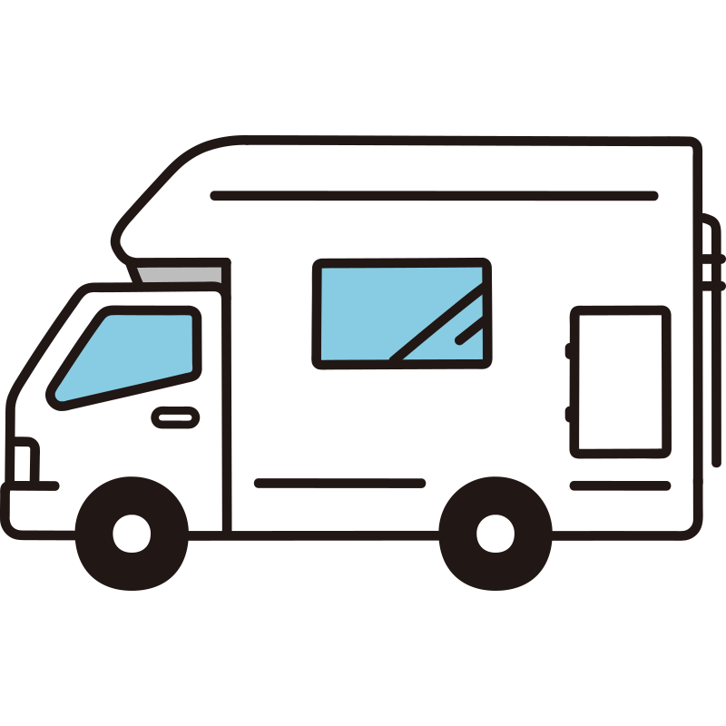

# Campers App

Welcome to **Campers App**—your go-to platform for renting the best camper vans
for your next adventure. Whether you're planning a weekend getaway or an
extended road trip, we have the perfect vehicle to meet your needs.



## Table of Contents

- [Features](#features)
- [Structure](#structure)
- [Getting Started](#getting-started)
- [Installation](#installation)

## Features

- **Wide Selection**: Choose from a variety of camper vans.
- **Easy Booking**: Simple and fast online booking process.
- **Customizable Options**: Add extra features like TV, shower, kitchen, and
  more.
- **User Reviews**: Read reviews from other customers to help you make the best
  choice.

  The application consists of three pages:

## Structure

- **Home Page**: Provides a general overview of the services offered by the
  company.
- **Catalog Page**: Displays a catalog of campers with various configurations,
  which the user can filter by location, equipment, and type.
- **Favorites Page**: Shows a list of ads that the user has added to their
  favorites.

## Getting Started

To start using Campers App, visit
[campersland.netlify.app](https://campersland.netlify.app) Browse our collection
of camper vans, and book your preferred vehicle in just a few clicks.

## Installation

For developers looking to run the project locally:

```bash
git clone https://github.com/atremat/campers.git
cd campers
npm install
```
